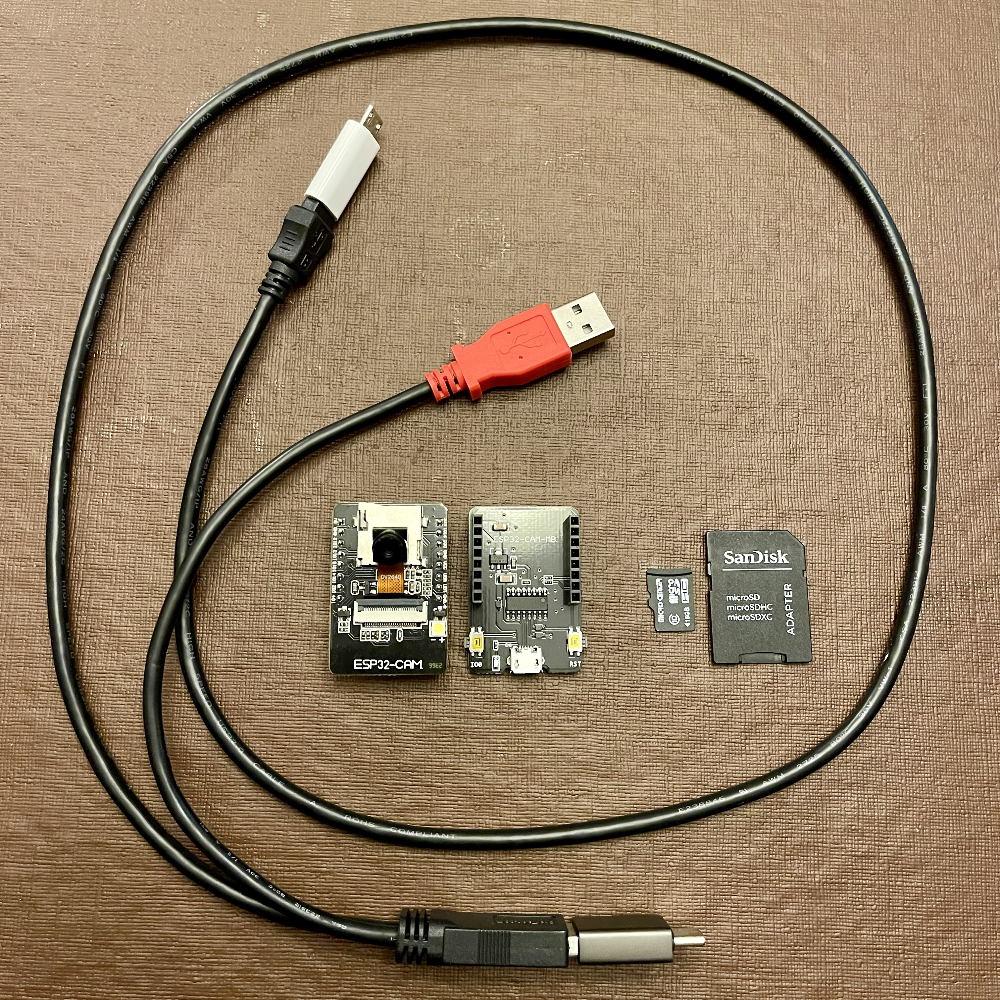

# 3DPrinterCam
Low budget and simple ESP32-CAM 3DPrinter Camera

I have recently purchased a Prusa MK4 printer. It does not have a camera. I do not wish to bring in OctoPrint given the printer is already WIFI enabled and has an extra USB port. The code and hardware for this project should work with any printer vendor.

The ESP32-CAM is a very capable self-contained Arduino WIFI-enabled camera. The camera may be purchased from many vendors. It runs about 10 US$, including a USB-TTL Serial (USB) Adapter Module. There are many excellent YouTube videos to take you through setting up the camera for development.

The MK4 does not provide power from its USB-C port. If your printer will not supply 5V then you will need a USB Y Cable designed to supply supplimental power from the extra plug. There may be other ways to pull the power from the MK4 board.

You will need to modify your printer slicer settings so the printer can command the camera. There may be ideal GCODE pause commands.
- `M118 snapbegin` to begin
- `M118 snapend` to end
- `M118 snaplayer` to layer change

I am cribbing a lot of logic from: [ESP32-CAM_MJPEG2SD](https://github.com/s60sc/ESP32-CAM_MJPEG2SD)
That project does a lot more than what we need and not exactly what we need. Despite being a global-variable mess, it is an excellent source.

## Code Status:

I have not yet created an end to end time-lapse. Creating a timelapse is possible using the Arduino IDE Serial Monitor. I would like to implement the WIFI and basic WebServer first. That is how we will get feedback when hooked up to printer.

### MyConfig.h
You will need to copy/rename MyConfig.hh and make any needed hardware declaration changes.

### 3DPrinterCam.nio
This is the main entry point into the program. The only buxsiness logic is parsing the serial commands.\
TODO: serial reads for the commands are fine for protoype but should be more robust\
TODO: eliminate 'begin' and pass GCODE file name as part of other commands (use date if not supplied)

### Globals.h/cpp camera_pins.h
Junk Drawer. This is where the hardware defines reside.\
TODO: finish debugMemory

### Camera.h/cpp
Camera setup, config, and frame capture\
TODO: expose camera settings and flash for external control

### Storage.h/cpp
File System setup\
TODO: test other things than just the SD Card\
TODO: file(s) access for CamServer

### AVI.h/cpp
Saves captures as timelapsed AVI moview files
TODO: max frames compare fails\
TODO: tune FPS\
TODO: auto close on timer\
TODO: use file name as begin/end markers

### WifiConnection.h/cpp
WIIFI and Time setup\
TODO: use

### CamServer
Restful web server for files and remote control. No need for HTML.\
TODO: implement

## Images

## 3D Printed Components
[Self Promotion](https://www.printables.com/@Jove/models)

## My shopping list:
[ESP32-Cam](https://www.amazon.com/dp/B0948ZFTQZ?psc=1&ref=ppx_yo2ov_dt_b_product_details)\
Any micro SD Card\
[Power Adaptor](https://www.amazon.com/dp/B003HHK576?psc=1&ref=ppx_yo2ov_dt_b_product_details)\
[USB-A to USB-C](https://www.amazon.com/dp/B09SZ5NHF4?psc=1&ref=ppx_yo2ov_dt_b_product_details)\
[USB-Mini to USB-Micro](https://www.amazon.com/dp/B08FRNCQXP?psc=1&ref=ppx_yo2ov_dt_b_product_details)
